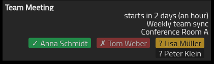

# Changelog

All notable changes to this project will be documented in this file.
This project adheres to [Semantic Versioning](https://semver.org/).

## [2.0.0](https://github.com/MMM-CalendarExt2/MMM-CalendarExt2/compare/v1.4.21...v2.0.0) 2025-11-13

### Major Changes

#### Migration from Moment.js to Day.js

This release replaces Moment.js with the modern Day.js library. While Day.js is API-compatible and extensive testing has been performed, this fundamental change to the module's date handling warrants a major version bump per semantic versioning. Your existing configuration should work unchanged, but edge cases in date/time formatting may exist. Please report any unexpected behavior.

### New Features & Improvements

- feat: display attendees/guests in calendar events (solves [#100](https://github.com/MMM-CalendarExt2/MMM-CalendarExt2/issues/100))
  - Extract and show attendees from iCal ATTENDEE properties
  - Color-coded status badges (green/red/yellow)
  - Email privacy obfuscation
  - Configurable via showAttendees option (default: enabled)
  - Screenshot:
    
- feat: add HTTP error cooldown handling (solves [#237](https://github.com/MMM-CalendarExt2/MMM-CalendarExt2/issues/237))
  - Implement smart retry logic to prevent account lockouts and respect rate limits. Auth errors (401/403) and client errors (4xx) trigger 1-hour cooldowns, rate limits (429) respect Retry-After headers. Server errors (5xx) retry normally.

### Chore & Maintenance

- chore: update devDependencies
- chore: update Node.js setup action to version 6
- chore: update workflows to improve context printing and credential handling
- docs: remove obsolete memo regarding MMM-Carousel bug
- refactor: extract fetch logic to CalendarFetcher class
- refactor: move helper functions to lib directory

## [1.4.21](https://github.com/MMM-CalendarExt2/MMM-CalendarExt2/compare/v1.4.20...v1.4.21) 2025-10-06

- chore: update actions/setup-node to version 5 in automated tests workflow
- chore: update devDependencies
- docs: correct formatting for `slotAltTitleFormat` in week and month views

## [1.4.20](https://github.com/MMM-CalendarExt2/MMM-CalendarExt2/compare/v1.4.19...v1.4.20) 2025-09-08

- chore: update actions/checkout to version 5 in workflows
- chore: update dependencies
- refactor: improve error handling for iCal data parsing

## [1.4.19](https://github.com/MMM-CalendarExt2/MMM-CalendarExt2/compare/v1.4.18...v1.4.19) 2025-08-02

- chore: update devDependencies
- chore: update prepare script to handle missing husky installation gracefully
- chore: update Super-Linter to version 8

## [1.4.18](https://github.com/MMM-CalendarExt2/MMM-CalendarExt2/compare/v1.4.17...v1.4.18) 2025-07-25

- docs: change `var` to `let`
- fix: prevent undefined property access errors in ical.js event parsing (this should fix #401)

## [1.4.17](https://github.com/MMM-CalendarExt2/MMM-CalendarExt2/compare/v1.4.16...v1.4.17) 2025-07-23

- chore: update devDependencies
- refactor: remove empty stop method from NodeHelper
- refactor: replace unmaintained 'ical-expander' with 'ical.js'
  This should fix the issue with recurring events not being displayed correctly (#363).
- refactor: simplify payload handling by removing unused sender parameter

## [1.4.16](https://github.com/MMM-CalendarExt2/MMM-CalendarExt2/compare/v1.4.15...v1.4.16) 2025-07-06

- fix: ensure container visibility by removing hidden class (this should finally fix [#393](https://github.com/MMM-CalendarExt2/MMM-CalendarExt2/issues/393))
- refactor: improve calendar scanning methods
- refactor: simplify drawEvents method by removing layout wait logic

## [1.4.15](https://github.com/MMM-CalendarExt2/MMM-CalendarExt2/compare/v1.4.14...v1.4.15) 2025-07-06

- chore: update devDependencies
- docs: change clone command order in installation instructions
- docs: fix image URLs in `docs/Tip-Sync-with-MMM-Pages.md`
- docs: remove redundant empty lines in Event-Time documentation
- docs: update URLs in `README`
- refactor: enhance `drawEvents` method with layout readiness check (this should fix [#393](https://github.com/MMM-CalendarExt2/MMM-CalendarExt2/issues/393))

## [1.4.14](https://github.com/MMM-CalendarExt2/MMM-CalendarExt2/compare/v1.4.13...v1.4.14) 2025-06-03

- chore: add missing type field to `package.json`
- chore: update dependencies
- fix: correct `eventPool` slicing to properly limit items
- refactor: simplify and format code

## [1.4.13](https://github.com/MMM-CalendarExt2/MMM-CalendarExt2/compare/v1.4.12...v1.4.13) 2025-05-18 - Maintenance update

- chore: sort scripts
- chore: update devDependencies
- docs: adapt formatting of `README` and `CHANGELOG` entries for consistency

## [1.4.12](https://github.com/MMM-CalendarExt2/MMM-CalendarExt2/compare/v1.4.11...v1.4.12) 2025-05-17 - Maintenance update

- chore: add `husky` and `lint-staged` for pre-commit hooks
- chore: review linter setup
- chore: update devDependencies
- docs: format `README` and `CHANGELOG` entries for consistency

## [1.4.11](https://github.com/MMM-CalendarExt2/MMM-CalendarExt2/compare/v1.4.10...v1.4.11) 2025-04-30 - Maintenance update

- chore: add Code of Conduct
- chore: sharpen ESLint rules for consistency and error handling
- chore: switch from 'npm run' to 'node --run'
- chore: update devDependencies
- docs: update developer commands in `README`
- docs: update installation instructions to use `npm ci --omit=dev` to avoid installing `devDependencies`
- refactor: remove unused deprecated drawSlots method

## [1.4.10](https://github.com/MMM-CalendarExt2/MMM-CalendarExt2/compare/v1.4.9...v1.4.10) 2025-04-04 - Maintenance update

- fix: Handle null sceneUid correctly in work method. This will fix #383. It was caused by refactoring the code in 1.4.5 - commit 3c19d7c6091a127641e8ad87b27cedd470997e75.
- chore: Update devDependencies
- chore: update Dependabot configuration to include GitHub Actions ecosystem

## [1.4.9](https://github.com/MMM-CalendarExt2/MMM-CalendarExt2/compare/v1.4.8...v1.4.9) 2025-04-03 - Maintenance update

- Update dependencies
- refactor: update ESLint configuration to use new import plugin structure
- chore: add missing links and dates to releases in `CHANGELOG`

## [1.4.8](https://github.com/MMM-CalendarExt2/MMM-CalendarExt2/compare/v1.4.7...v1.4.8) 2025-03-11 - Maintenance update

- Update devDependencies
- Optimize stylelint configuration
- Rewording some parts of the `README`

## [1.4.7](https://github.com/MMM-CalendarExt2/MMM-CalendarExt2/compare/v1.4.6...v1.4.7) 2025-03-04 - Maintenance update

- Update CodeQL workflow
- Switch to superlinter 7
- Add formatting check step to CI
- Replace eslint-plugin-import by eslint-plugin-import
- Update devDependencies
- Simplify ESLint calls
- Remove unused release script
- Sort pakckage.json the npm standard way

## [1.4.6](https://github.com/MMM-CalendarExt2/MMM-CalendarExt2/compare/v1.4.5...v1.4.6) 2025-02-02 - Maintenance update

- Remove unused dependency `valid-url`
- Update dependencies

## [1.4.5](https://github.com/MMM-CalendarExt2/MMM-CalendarExt2/compare/v1.4.4...v1.4.5) 2024-12-06 - Maintenance update

- Optimize ESLint rules
  - remove unused
  - switch to some default settings
  - tightening up some settings
- Update devDependencies

## [1.4.4](https://github.com/MMM-CalendarExt2/MMM-CalendarExt2/compare/v1.4.3...v1.4.4) 2024-11-27

- Get rid of callback function `cb`
- Remove useless assignment and unnecessary use of `undefined`
- Simplify nodeVersion
- Optimize logging
- Update dependencies
- Update URL in `.editorconfig`
- Move Changelog from `README` to `CHANGELOG`
- Add link to LICENSE file in `README`
- Fix Update instructions in `README`

## [1.4.3](https://github.com/MMM-CalendarExt2/MMM-CalendarExt2/compare/v1.4.2...v1.4.3) 2024-10-28 - Maintenance update

- Add linting for Markdown
- Update dependencies
- Add `eslint-plugin-import`
- Remove unused `eslint-plugin-prettier`
- Switch to flat config for prettier and stylelint

## [1.4.2](https://github.com/MMM-CalendarExt2/MMM-CalendarExt2/compare/v1.4.1...v1.4.2) 2024-08-27 - Maintenance update

- Upgrade ESLint to v9
- Switch to ESLint flat config
- Update dependencies
- Disable validating JavaScript, CSS and JSON by super-linter

## [1.4.1](https://github.com/MMM-CalendarExt2/MMM-CalendarExt2/compare/v1.4.0...v1.4.1) 2024-01-01 - Maintenance update

- Update dependencies
- Update ESLint env
- Replace eslint-plugin-json by eslint-plugin-jsonc
- Update URLs to MagicMirror project

## [1.4.0](https://github.com/MMM-CalendarExt2/MMM-CalendarExt2/compare/v1.3.0...v1.4.0) 2023-10-10

- MODIFIED: Replace external package `node-fetch` by internal `fetch` - With this change, node version 18 or newer is required.

## [1.3.0](https://github.com/MMM-CalendarExt2/MMM-CalendarExt2/compare/v1.2.0...v1.3.0) 2022-03-07

- MODIFIED: Reduction of linting issues #158

## [1.2.0](https://github.com/MMM-CalendarExt2/MMM-CalendarExt2/compare/v1.1.0...v1.2.0) 2022-02-24

- ADDED: Basic auth support. #138
- MODIFIED: Introduction of Super-Linter and with it a large number of code adjustments (which should have no functional impact). #147

## [1.1.0](https://github.com/MMM-CalendarExt2/MMM-CalendarExt2/compare/v1.0.9...v1.1.0) 2022-02-11

- ADDED: Vertical Autosizing, Hidden Footer and Space right of items in week/month view #128
- MODIFIED: Replace deprecated package `request` by `node-fetch` #135
- FIXED: `git clone` problem with Windows #137

## [1.0.9](https://github.com/MMM-CalendarExt2/MMM-CalendarExt2/compare/v1.0.8...v1.0.9) 2020-02-14

- ADDED: `positionOrder` of `view`. now you can change the order of that view in region(position) against other modules.

## [1.0.8](https://github.com/MMM-CalendarExt2/MMM-CalendarExt2/compare/v1.0.7...v1.0.8) 2020-02-13

- ADDED: `isRecurring` property to `event` object. now you can check this event is recurred or not. You can use this in `filter/sort/transform` callbacks. and CSS class `recurred` will be added to that event.

## [1.0.7](https://github.com/MMM-CalendarExt2/MMM-CalendarExt2/compare/v1.0.6...v1.0.7) 2020-01-31

- MODIFIED: Default value of `maxItems` to `1000` from `100` to avoid frequently asking issue of `events of nowadays are not shown`
- MODIFIED: Automatically fixing of unofficial URI from `webcal://` URL to `http://`.

## [1.0.6](https://github.com/MMM-CalendarExt2/MMM-CalendarExt2/compare/v1.0.5...v1.0.6) 2019-12-12

- ADDED: `title` of view can have callback function as a value. Now you can make view title contextually

```js
title: "My Weekly",

or

title: (mObj) => { // moment object for first slot of view.
  return mObj.format("[My Weekly:] Wo")
},
// This will show "My Weekly: 49TH" as module title.
```

## [1.0.5](https://github.com/MMM-CalendarExt2/MMM-CalendarExt2/compare/v1.0.4...v1.0.5) 2019-08-23

- ADDED: can display name of Month (e.g: August) in `month` view (`monthFormat:"MMMM"`)

## [1.0.4](https://github.com/MMM-CalendarExt2/MMM-CalendarExt2/compare/v1.0.3...v1.0.4) 2019-03-26

- ADDED: event property `ms_busystatus` is added. (Thanks to @klaernie for the PR)

## [1.0.3](https://github.com/MMM-CalendarExt2/MMM-CalendarExt2/compare/v1.0.2...v1.0.3) 2019-03-25

- FIXED: calendar filter is implemented (Sorry, I've totally forgotten it).

## [1.0.2](https://github.com/MMM-CalendarExt2/MMM-CalendarExt2/compare/v1.0.1...v1.0.2) 2019-02-14

- FIXED: not visible in second or followed pages of MMM-pages.

## [1.0.1](https://github.com/MMM-CalendarExt2/MMM-CalendarExt2/compare/v1.0.0...v1.0.1) 2019-02-11

- `view:transform()` is added, now you can modify event value as your wish.
