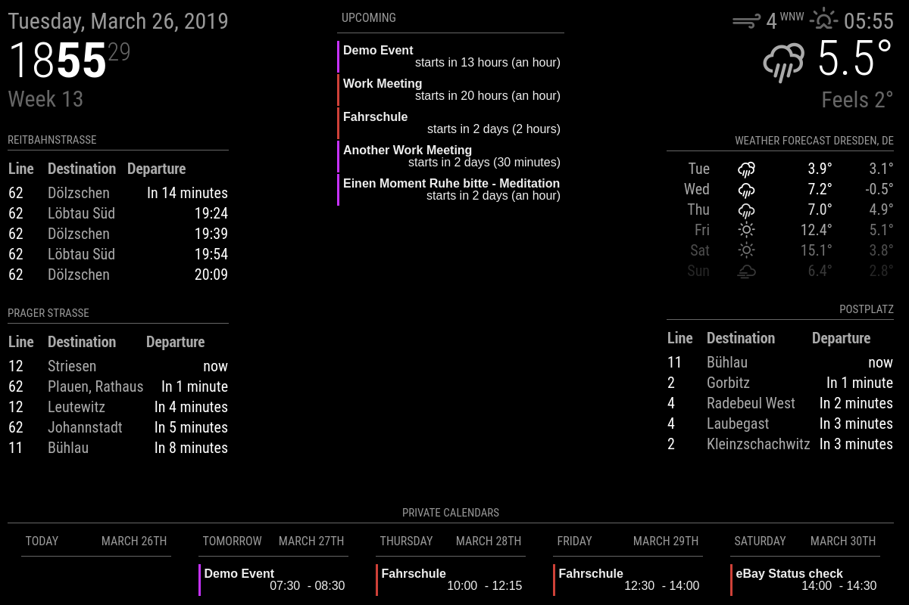

# Klaernie's Config

This config is intended to be used by the three people in our household. My
girlfriend and me both have a private and business calendar each, and our kid
also has a calendar with important events (think doctor visits) and private
events.

Style-wise we like a clean and largely monochrome look, with some color
sprinkled in to remove ambiguity.

The actual calendar data is synced with vdirsyncer into the
`~/MagicMirror/modules/calendars` folder, as vdirsyncer can reduce the overall
amount of events to a suitable set while being able to easily integrate iCloud,
Google Calendar and Outlook 365 calendars at the same time.

## How does the result look?



## config.js

The config actually is nothing too complex. To keep the information amount
manageable in the `daily` view at the bottom the `Private` and `Work` calendars
alternate. Only the `upcoming` view stays present all the time.

Calendars are all loaded from the location vdirsyncer writes to. Anja's work
calendar also hides events where Anja isn't yet sure, if the will go, but I
like to see my maybe-events. Finally Tobi's personal calendar includes a
usually daily event `Schule` (`school`) which doesn't need to be listed on the
Mirror, as he knows pretty well that he needs to go to school.

```javascript
{
	module: 'MMM-CalendarExt2',
	config: {
		rotateInterval: 90*1000,
		scenes:[
			{
				name: "DEFAULT",
				views: ["upcoming","Overview Private"],
			},
			{
				name: "WorkMode",
				views: ["upcoming","Overview Work"],
			},
		],
		views:[
			{
				name: "upcoming",
				mode: "upcoming",
				position: "top_center",
				maxItems: 5,
				maxDays: 1,
				locale: "en",
				hideOverflow: false,
				filterPassedEvent: true,
				calendars: ["Anja","Anja Work","Andre","Andre Work","Tobi","Tobi Shared"],
			},
			{
				name: "Overview Private",
				title: "Private Calendars",
				mode: "daily",
				type: "row",
				position: "bottom_bar",
				slotCount: 5,
				locale: "en",
				hideOverflow: false,
				filterPassedEvent: true,
				calendars: ["Anja","Andre","Tobi","Tobi Shared"],
			},
			{
				name: "Overview Work",
				title: "Work Calendars",
				mode: "daily",
				type: "row",
				position: "bottom_bar",
				slotCount: 5,
				locale: "en",
				hideOverflow: false,
				filterPassedEvent: true,
				calendars: ["Anja Work","Andre Work"],
			},
		],
		calendars: [
			{
				name: "Anja",
				url: "http://localhost:8080/modules/calendars/AnjaPrivate.ics",
			},
			{
				name: "Anja Work",
				url: "http://localhost:8080/modules/calendars/O365_Anja.ics",
				filter: (event) => {
					if (event.ms_busystatus == "TENTATIVE") {
						return false
					}
					return true
				},
			},
			{
				name: "Andre",
				url: "http://localhost:8080/modules/calendars/AndrePrivate.ics",
			},
			{
				name: "Andre Work",
				url: "http://localhost:8080/modules/calendars/O365_Andre.ics",
			},
			{
				name: "Tobi",
				url: "http://localhost:8080/modules/calendars/TobiPrivate.ics",
				filter: (event) => {
					if (event.title == "Schule") {
						return false
					}
					return true
				},
			},
			{
				name: "Tobi Shared",
				url: "http://localhost:8080/modules/calendars/TobiShared.ics",
			},
		],
	},
},
```

## css/custom.css

As our Mirror display only has a resolution of 1280x800 I decided to reduce the
margins on the entire mirror and remove the `+1` space marking omitted events
(no events are ever omitted, see `hideOverflow: false` in `config.js`).

The styling for MMM-CalendarExt2 is largely based on the default MagicMirror
look.
I also removed the background colors on all events (which means I also need to
use the text color from outside in fullday events, as they would be
black-on-black instead).

To save a few more pixels the entire `eventTime` for fullday events get's
hidden as well.

Finally the events are color-coded per-person, so that Anja and I can
differentiate who has which meeting. This is done with a 3px border on the left
side, a style found in some mobile calendar apps' schedule view.

```css
body {
	margin: 10px;
	height: calc(100% - 20px);
	width: calc(100% - 30px);
}
.CX2 .agenda .eventSub {
	display:none;
}
.CX2 .daily .fullday .eventTime {
	display:none;
}
.CX2 .slot .event{
	background: inherit;
}
.CX2 .slot .slotHeader{
	background-color: inherit;
	text-transform: uppercase;
	font-size: 15px;
	font-family: "Roboto Condensed", Arial, Helvetica, sans-serif;
	font-weight: 400;
	border-bottom: 1px solid #666;
	line-height: 15px;
	padding-bottom: 5px;
	margin-bottom: 10px;
	color: #999;
}
.CX2 .today .slotHeader * {
	color: inherit;
}
.CX2 .event.fullday {
	color: inherit;
}
.CX2 .slot .slotFooter {
	display: none;
}
.CX2 .event[data-calendar-name="Andre"],
.CX2 .event[data-calendar-name="Andre Work"] {
	border-left: #ce4138 solid;
}
.CX2 .event[data-calendar-name="Anja"],
.CX2 .event[data-calendar-name="Anja Work"] {
	border-left: #c632ff solid;
}
.CX2 .event[data-calendar-name="Tobi"],
.CX2 .event[data-calendar-name="Tobi Shared"] {
	border-left: #d2cf2a solid;
}
```

