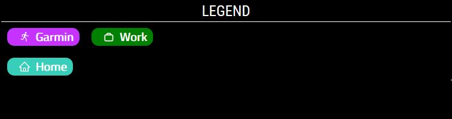
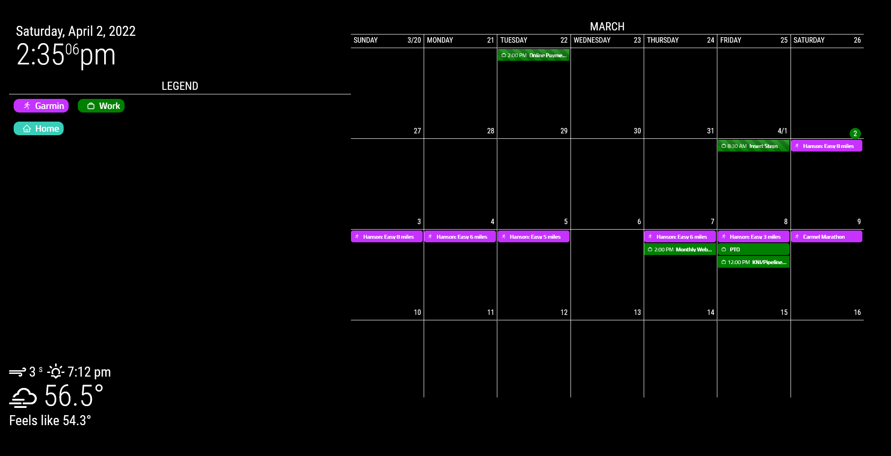

<!-- markdownlint-disable-file MD041 -->

## View:legend

The purpose of this view is to show a legend of all calendars specified in the
configuration to display. The legend is typically used on a large calendar view
to denote different calendars being used. For example, you might have a Google
calendar for work and another for home. The legend will allow you or a guest to
quickly differentiate events on your calendar from home or work. This makes more
sense when you add colors in a custom CSS file or add a class name to the
calendar. The legend is a quick reference to see what colors or icons match to
the calendar.

### Configuration Reference

```js
{
  name: "Legend",
    title: "Legend",
    mode: "legend",
    calendars: ["Garmin", "Work", "Home"],
    position: "top_left"
},
```

## Example

### Legend



### Legend with Calendar


