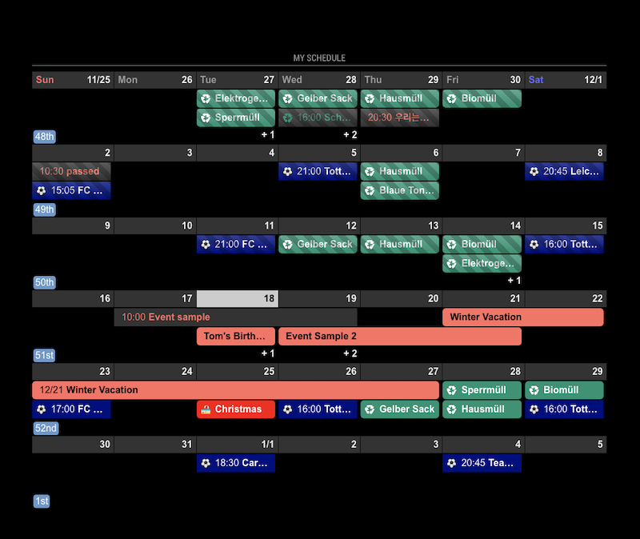

<!-- markdownlint-disable-file MD041 -->

You can use all of common fields of [View](../View.md) in these views also.

`view:week` and `view:month` could be too wide and tall for small screen. Use it carefully.

If you set these view positions as `fullscreen_below` or `fullscreen_above`, these views will be fixed in bottom. You can adjust position with CSS

# View:week

| field              | value type | value example | default value | memo                                                                                                                       |
| ------------------ | ---------- | ------------- | ------------- | -------------------------------------------------------------------------------------------------------------------------- |
| slotTitleFormat    | String     | "M/D"         | "D"           | date of calendar cell                                                                                                      |
| slotSubTitleFormat | String     | "dddd"        | "ddd"         | weekday of calendar cell                                                                                                   |
| slotAltTitleFormat | String     | "MMM D        | "M/D"         | Only for view:week and view:month. <br>Alternative slot title when it is needed.(e.g: month changed, start of calendar...) |
| showWeekends       | Boolean    | false         | true          | Show Saturday and Sunday.                                                                                                  |
| slotMaxHeight      | String     | "150px"       | "240px"       | height of calendar cell. `hideOverflow` is set to `true` by force in this view.                                            |
| weeksFormat        | String     | "[week] wo"   | "wo"          | Weeks mark of calendar.                                                                                                    |
| monthFormat        | String     | "[Month:] MM" | "MMMM"        | The title of month in current view. (CSS selector:`.monthViewTitle`)                                                       |

# View:month

| field              | value type | value example | default value | memo                                                                                                                       |
| ------------------ | ---------- | ------------- | ------------- | -------------------------------------------------------------------------------------------------------------------------- |
| slotTitleFormat    | String     | "M/D"         | "D"           | date of calendar cell                                                                                                      |
| slotSubTitleFormat | String     | "dddd"        | "ddd"         | weekday of calendar cell                                                                                                   |
| slotAltTitleFormat | String     | "MMM D        | "M/D"         | Only for view:week and view:month. <br>Alternative slot title when it is needed.(e.g: month changed, start of calendar...) |
| showWeekends       | Boolean    | false         | true          | Show Saturday and Sunday.                                                                                                  |
| slotMaxHeight      | String     | "120px"       | "150px"       | height of calendar cell. `hideOverflow` is set to `true` by force in this view.                                            |
| weeksFormat        | String     | "[week] wo"   | "wo"          | Weeks mark of calendar.                                                                                                    |

- In `view:month`, `slotCount` will be ignored.

## Examples

- Basic Sample

```js
{
  name: "VIEW1",
  mode: "week",
  position: "fullscreen_below",
  title: "My Schedule",
},
```


- modification Sample.

```js
{
  name: "VIEW1",
  mode: "week",
  position: "fullscreen_below",
  title: "My Schedule",
  fromNow: -1,
  slotCount: 4,
  slotMaxHeight: "120px",
  showWeekends: false,
},
```


- another sample.

```js
{
  name: "VIEW1",
  mode: "month",
  position: "bottom_bar",
  title: "My Schedule",
  slotMaxHeight: "70px",
  dateFormat: "M/D",
},
```



- In this example, I changed screen resolution from wide:1920 to wide:1080.(vertical layout). You can see view:month is too narrow in `bottom_bar`. Put it into `fullscreen`.
